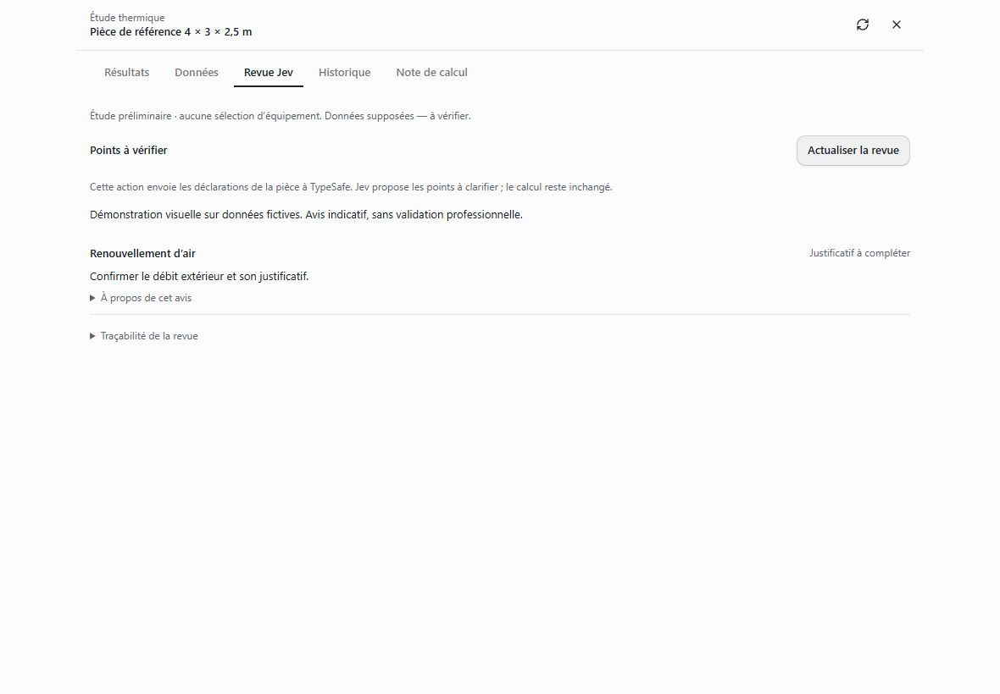
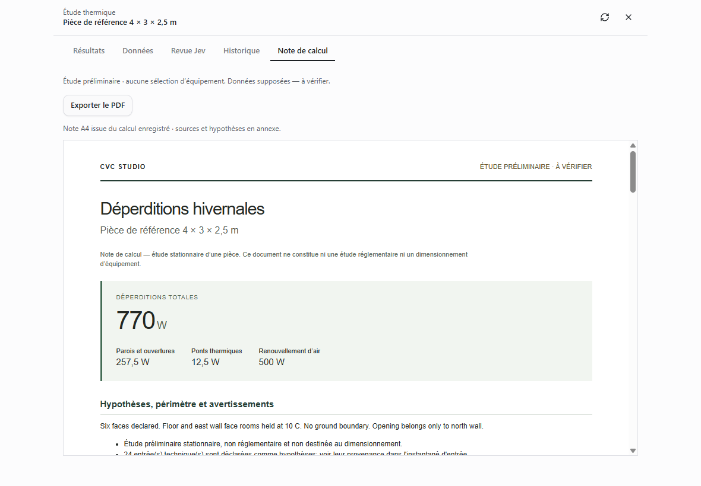

# Desktop integration: Jev, U-values and PDF (2026-09-27)

This batch integrates only opaque-wall U and window U from hvac-design commit 15859db3a4bb618fe0416fa17de28338fcc818d2. The other calculation modules remain outside the desktop runtime. Imported arithmetic is preliminary, not verified against licensed standard text.

## Available now

- Chat tools `cvc_opaque_u` and `cvc_window_u` require explicit sourced inputs; they return deterministic calculations and the input snapshot. Applying a value to a room remains an explicit revision operation.
- `cvc_review` and the native **Revue Jev** tab assess declarations in one batch (scope, boundaries, air, bridges, and up to 24 surfaces). Reviews identify the saved run, input hash, question version and service model. They cannot mutate engineering results. Missing credentials, incomplete responses and service failures are shown as unavailable. No cited document is fetched or authenticated.
- The native **Note de calcul** tab offers **Exporter le PDF**, with a Windows save dialog and a readable filename. Electron renders A4 with scripts, remote resources and navigation disabled. Results and all input provenance come from the verified saved calculation. Browser preview falls back to its print dialog.

## Evidence and verification

- Room-study suite: 59 passing tests, including report escaping and saved-run validation.
- Server integration batch: 15 passing tests covering routes, tools and Jev failure handling; server typecheck and production build pass.
- Native panel: four passing tests; app typecheck and production UI build pass.
- Live Jev smoke check used only the synthetic reference room: ready, model jev-1.13.0, ten findings. Credentials were not logged.
- Actual Electron PDF renderer produced a four-page reference note. Every page was rendered with Poppler and visually inspected; extracted text includes 770 W, 257.5 W, 12.5 W, 500 W, provenance and run identity (French decimal commas).
- Screenshots below exercise the actual React component with a clearly fictional adapter. They demonstrate layout, not live service acceptance or the Windows save dialog.

Design principles: P3 progressive disclosure keeps model confidence and trace IDs collapsed; P7 gives the result first; P10 supplies rendered evidence; P11 preserves the existing study tabs and saved-run workflow.

## Remaining scope

Company logo/contact settings, author/reviewer metadata, an archive of issued PDFs, persisted Jev reviews, confidence calibration on an engineering evaluation set, and the remaining calculation-module adapters are not implemented in this batch. Jev does not certify standards compliance, engineering validity or source authenticity. The preliminary room method still cannot size equipment or issue RE2020/DPE results.

## User test

Open a saved study, select Revue Jev, and choose Revoir avec Jev. Assumed fixture inputs should lead to requests for evidence, not professional approval. Select Note de calcul, export the PDF and check the total against Results. Revise a temperature: previous calculations must remain accessible and an old Jev review must not appear for the new run.
